# LQ.AI — System Architecture

> **Visual companion to [PRD v0.2](PRD.md).** This document renders the v1 architecture as a Mermaid diagram and walks through the architectural choices for contributors and procurement evaluators. The diagram below covers the full M1–M4 target architecture with M5+ forward-looking elements drawn as dashed slots; what runs at the M1 baseline is a strict subset, called out in the milestone breakdown further down.

For a per-capability shipped-vs-deferred catalog with verification paths, see [HONEST-STATE.md](HONEST-STATE.md).

---

## System diagram

```mermaid
flowchart TB
    %% =========================================
    %%   CLIENT SURFACES
    %% =========================================
    subgraph CLIENTS["💻 Client Surfaces"]
        direction LR
        web["<b>Web App</b><br/>OpenWebUI fork<br/><i>M1</i>"]
        word["<b>Word Add-In</b><br/>Office.js<br/><i>M3</i>"]
        slack["<b>Slack/Teams<br/>Bridge</b><br/>profile-gated<br/><i>M3 optional</i>"]
        today["<b>Today View</b><br/>workflow concierge<br/><i>M5+ forward-looking</i>"]:::forwardLooking
    end

    %% =========================================
    %%   BACKEND (FastAPI)
    %% =========================================
    subgraph BACKEND["🧠 LQ.AI Backend (FastAPI)"]
        direction TB
        api["<b>OpenAPI 3.1 Surface</b><br/>Authn/Authz · RBAC · MFA option<br/>Privilege-aware Audit Log<br/><i>M1</i>"]

        subgraph CORE_SERVICES["Core Services"]
            direction LR
            proj["<b>Project Service</b><br/>matter-scoped<br/>containers<br/>privilege flag<br/><i>M1</i>"]
            skill["<b>Skill Service</b><br/>incl. Org Profile<br/>singleton<br/><i>M1</i>"]
            playbook["<b>Playbook Service</b><br/>LangGraph<br/>workflows<br/><i>M3</i>"]
            doc["<b>Document Pipeline</b><br/>Docling + PyMuPDF +<br/>OCR + Citation Engine<br/><i>M2</i>"]
            knowledge["<b>Knowledge Service</b><br/>pgvector + FTS;<br/>contract-relationship<br/>graph in M4<br/><i>M1/M4</i>"]
            autonomous["<b>Autonomous Layer</b><br/>Pipelines · cron ·<br/>watches · per-user<br/>memory<br/><i>M4</i>"]
        end

        mcp["<b>MCP-Client Subsystem</b><br/>integration substrate;<br/>architectural slot opened in M2<br/>even though no connectors ship until M5+<br/><i>M2 slot</i>"]
        signal["<b>Signal Aggregation Service</b><br/>workspace events<br/>via MCP<br/><i>M5+ forward-looking</i>"]:::forwardLooking
    end

    %% =========================================
    %%   INFERENCE GATEWAY
    %% =========================================
    subgraph GATEWAY["🚪 Inference Gateway (~3,000 LOC, built in-house)"]
        gateway["<b>Single security-bounded service</b><br/><br/>Auth → Router → Rate Limit → <b>Tier Derivation</b> →<br/><b>Anonymization (M2)</b> → Provider Adapters →<br/>Cost Tracker → Telemetry<br/><br/>Annotates every request with <i>routed_inference_tier</i> (1–5)<br/>Refuses requests below skill or Project minimum tier<br/><br/><i>M1 baseline; Anonymization adds in M2</i>"]
    end

    %% =========================================
    %%   STORAGE (operator's environment)
    %% =========================================
    subgraph STORAGE["💾 Storage (operator's environment)"]
        direction LR
        postgres["<b>PostgreSQL + pgvector</b><br/>app data · vectors · FTS<br/>privilege-aware audit log<br/>work-product attribution"]
        redis["<b>Redis</b><br/>sessions · queues<br/>pubsub"]
        minio["<b>MinIO / S3-compatible</b><br/>file storage"]
    end

    %% =========================================
    %%   LLM PROVIDERS (operator's choice)
    %% =========================================
    subgraph PROVIDERS["🌐 LLM Providers (operator's choice; configured per-deployment)"]
        direction LR
        cloud["<b>Cloud Providers</b><br/>Anthropic · OpenAI · Vertex<br/>Cohere · Azure OpenAI · Bedrock<br/><i>Tier 2–4 depending on configuration</i>"]
        local["<b>Local Providers</b><br/>Ollama · vLLM · llama.cpp<br/>any OpenAI-compatible endpoint<br/><i>Tier 1 — air-gap-capable</i>"]
    end

    %% =========================================
    %%   EXTERNAL (M5+ via MCP)
    %% =========================================
    subgraph EXTERNAL["🔮 External Workflow Sources via MCP — M5+ forward-looking"]
        direction LR
        email["<b>Email</b><br/>Gmail · Outlook"]:::forwardLooking
        calendar["<b>Calendar</b><br/>Google · Microsoft"]:::forwardLooking
        tasks["<b>Task Systems</b><br/>Asana · Linear ·<br/>Jira · Monday"]:::forwardLooking
        crm["<b>CRM</b><br/>Salesforce ·<br/>HubSpot"]:::forwardLooking
        docstore["<b>Doc Stores</b><br/>SharePoint · Drive ·<br/>OneDrive · Box"]:::forwardLooking
    end

    %% =========================================
    %%   OBSERVABILITY (optional)
    %% =========================================
    subgraph OBS["📊 Observability (optional, off by default)"]
        direction LR
        otel["<b>OpenTelemetry</b><br/>→ Grafana / Tempo / Loki<br/>→ Honeycomb · Datadog · etc."]
        langfuse["<b>Langfuse</b><br/>self-hosted<br/>LLM-specific tracing"]
    end

    %% =========================================
    %%   EDGES — client to backend
    %% =========================================
    web -->|"OpenAPI 3.1<br/>over HTTPS"| api
    word -->|"OpenAPI 3.1<br/>over HTTPS"| api
    slack -->|"OpenAPI 3.1<br/>over HTTPS"| api
    today -.->|"OpenAPI 3.1"| api

    %% =========================================
    %%   EDGES — backend internal
    %% =========================================
    api --> proj
    api --> skill
    api --> playbook
    api --> doc
    api --> knowledge
    api --> autonomous

    %% =========================================
    %%   EDGES — services to gateway
    %% =========================================
    skill --> gateway
    playbook --> gateway
    doc --> gateway
    knowledge --> gateway
    autonomous --> gateway

    %% =========================================
    %%   EDGES — services to MCP slot
    %% =========================================
    skill -.->|"M5+:<br/>tools<br/>over MCP"| mcp
    autonomous -.-> mcp
    signal -.-> mcp

    %% =========================================
    %%   EDGES — services to storage
    %% =========================================
    proj --> postgres
    skill --> postgres
    playbook --> postgres
    knowledge --> postgres
    autonomous --> postgres
    api --> redis
    doc --> minio
    api -->|audit log| postgres

    %% =========================================
    %%   EDGES — gateway to providers
    %% =========================================
    gateway -->|"Tier 2-4<br/>HTTPS"| cloud
    gateway -->|"Tier 1<br/>local socket"| local

    %% =========================================
    %%   EDGES — observability
    %% =========================================
    gateway -.-> otel
    gateway -.-> langfuse
    api -.-> otel

    %% =========================================
    %%   EDGES — MCP to external (forward)
    %% =========================================
    mcp -.->|"M5+"| email
    mcp -.->|"M5+"| calendar
    mcp -.->|"M5+"| tasks
    mcp -.->|"M5+"| crm
    mcp -.->|"M5+"| docstore

    %% =========================================
    %%   STYLING
    %% =========================================
    classDef forwardLooking stroke-dasharray: 5 5,fill:#fff8dc,color:#7a5c00,stroke:#c9b037
    style CLIENTS fill:#e3f2fd,stroke:#1976d2
    style BACKEND fill:#f3e5f5,stroke:#7b1fa2
    style CORE_SERVICES fill:#faf5fc,stroke:#9c27b0,stroke-dasharray: 0
    style GATEWAY fill:#e8f5e9,stroke:#2e7d32
    style STORAGE fill:#fff3e0,stroke:#ef6c00
    style PROVIDERS fill:#fce4ec,stroke:#c2185b
    style EXTERNAL fill:#fffde7,stroke:#c9b037,stroke-dasharray: 5 5
    style OBS fill:#f5f5f5,stroke:#616161
```



---

## Legend

- **Solid borders / saturated fills** — components that ship in the v1 release path (M1–M4).
- **Dashed borders / muted fills** — forward-looking M5+ elements; the architectural slot is committed in M1–M2 (the MCP-Client Subsystem) so these can be implemented incrementally without core refactoring, but they are explicitly **not** committed for delivery.
- **Solid edges** — request paths that exist at v1.
- **Dashed edges** — request paths that exist only when forward-looking elements are present.
- **`Mn` tags** — the milestone at which the component lands.

---

## What sits where, and why

The architecture is shaped by three commitments:

**Self-hosted, with the customer's keys, in the customer's environment.** Storage (Postgres + Redis + MinIO/S3) lives entirely in the operator's environment; the application services run alongside; the only data that potentially leaves the operator's environment is the inference call to the configured provider. There is no LegalQuants-side SaaS holding customer data — by design, no telemetry is emitted by default, and what telemetry the operator opts into contains no content. (See [PRD §5.7 No Telemetry by Default](PRD.md#57-no-telemetry-by-default).)

**The Inference Gateway is the security boundary.** It is the single component holding privileged provider API keys and the only egress path for customer prompts. We build it in-house in ~3,000 lines of focused Python rather than adopting LiteLLM (whose security history includes proxy auth bypasses and SSRF in document loaders) — for an open-source project where users may run with our defaults, that surface area is unacceptable. Every request passes through Auth → Router → Rate Limit → Tier Derivation → Anonymization (M2) → Provider Adapters → Cost Tracker → Telemetry, and is annotated with the derived Inference Tier (1–5) before leaving. Skills and Projects can refuse to run below their declared minimum tier. (See [PRD §4 The LQ.AI Inference Gateway](PRD.md#4-the-lq-ai-inference-gateway) and [§4.7 Anonymization Layer](PRD.md#47-anonymization-layer-m2).)

**The architectural slot for M5+ is opened in M1–M2.** The MCP-Client Subsystem (per [PRD §8 M1 deliverables](PRD.md#m1--foundation-6-weeks)) is committed in the v1 architecture even though no connectors ship before M5+. The cost is small (~2 weeks of architectural work and documentation); the value is significant (the M5+ Forward-Looking Workflow Intelligence direction does not require retrofitting MCP into a v1 architecture that did not anticipate it; community contributors can plug in MCP servers — for email, calendar, task systems, document stores, CRM — without core changes). The Signal Aggregation Service is shown as a forward-looking dashed component because it is the next layer above the MCP-Client substrate; it lands at M5 in the forward-looking roadmap.

---

## Milestone breakdown

The diagram is the M1–M4 target architecture; the milestone-by-milestone breakdown shows what is added at each release.

### M1 — Foundation

M1 is the foundation release: a self-hostable deployment that delivers conversational legal AI on top of the ten starter skills, with the engineering surfaces that M2–M4 capability work builds on. The surfaces below are wired end-to-end and covered by Cypress E2E; for the authoritative per-capability shipped-vs-deferred catalog with verification paths, see [HONEST-STATE.md](HONEST-STATE.md) §§1–6.

**User-facing surfaces that ship in M1:**
- **Conversational core:** multi-turn chat with persistent history, full-text search across chat history, streaming SSE responses, matter (project) workspaces at `/lq-ai/matters/[id]` with inherited files/skills/knowledge bases.
- **Skill library and Skill Creator:** browse built-in, user, and team skills; capture a chat reply as a skill; wizard-based authoring from scratch; fork built-in or team skills; skill versions tab with per-version audit; Try-It sandbox per skill. Slash-invoked skills render a provenance pill on every response.
- **Knowledge bases:** create knowledge bases, attach documents, upload PDFs, ingest to `ready` state (pgvector + FTS hybrid retrieval; full Citation Engine pipeline lands M2).
- **Saved Prompts:** standalone library surface with one-click "Use in chat."
- **Receipts drawer:** per-event provenance drawer in chat, including Wave 7.2 source enrichment. Available on every chat message.
- **Enhance Prompt (⌘E):** prompt-expansion skill available per-chat.
- **Tier-floor refusal + admin override:** tier enforcement UI with admin-only override for privileged matters.
- **Audit log and admin viewer:** all sensitive actions logged; admin surface at `/lq-ai/admin/audit-log`.
- **GDPR-aligned export and account deletion:** per-user data export and account deletion flows.

**Engineering infrastructure that ships in M1:**
- Web App (OpenWebUI fork) and FastAPI backend.
- Project Service (matter-scoped containers, including the optional `privileged: true` flag).
- Skill Service, including the Organization Profile as a singleton skill.
- Knowledge Service (pgvector + FTS hybrid retrieval, baseline; contract-relationship graph follows in M4).
- Inference Gateway core: Auth, Router, Rate Limit, **Tier Derivation**, Provider Adapters (Anthropic, OpenAI, Ollama), Cost Tracker, Telemetry.
- Privilege-aware Audit Log fields (`privilege_marked`, `privilege_basis`, `routed_inference_tier`).
- MFA-mandatory option and session-timeout defaults.
- Compliance Alignment Pack documentation (`docs/compliance/`).
- Code & Supply-Chain Transparency artifacts (SBOM, signed images, SLSA-3 build provenance, public threat model).
- **Cypress E2E:** 6 LQ.AI specs (`wave-a-chrome`, `wave-b-surfaces`, `wave-c-matters`, `wave-d1-power-features`, `wave-d2-skill-creator`, `wave-m1-final-surfaces`) covering all user-facing surfaces listed above.

**Not in M1 (shipped in M2):**
- Citation Engine verification pipeline — **shipped in M2-A through M2-D** as a 4-stage cascade (exact match → tolerant match → paraphrase judge → ensemble). See [PRD §3.3](PRD.md#33-citation-engine-exact-quote) and [HONEST-STATE.md §3](HONEST-STATE.md#3-m2-shipped-capabilities--citation-engine-and-anonymization-layer).
- Anonymization Layer middleware — **shipped in M2-B3** with M2-D2 retrieval-context skip + M2-D3 privileged-project handling. See [PRD §4.7](PRD.md#47-anonymization-layer-m2) and the honest validation-posture caveat at [`docs/security/anonymization.md`](security/anonymization.md#whats-validated-vs-whats-unvalidated).
- MCP-Client Subsystem architectural slot — moved to M2 during M1 planning to keep M1 scope focused; M2 retained the slot as a design commitment with no connectors shipping until M5+.

**Storage and providers** stand up in M1; both deployment modes (Mode 1 cloud, Mode 2 local) are operational.

### M2 — Citation Engine, Anonymization, and Azure OpenAI (SHIPPED 2026-05-17)

**Shipped:**
- **Citation Engine** — 4-stage verification cascade (`exact_match` / `tolerant_match` / `paraphrase_judge` / `ensemble_strict` | `ensemble_majority`) with M2-C2 UI rendering states, M2-D1 ensemble + tier envelope, M2-E2 per-judge cost calibration. See [PRD §3.3](PRD.md#33-citation-engine-exact-quote).
- **Anonymization Layer** — pre/post middleware in the Inference Gateway pseudonymizing sensitive entities before the model call and rehydrating on response. Retrieval-context skip (M2-D2) leaves source quotes intact for citation grounding. Privileged-project handling (M2-D3) cross-cuts with tier-floor enforcement. Honest validation posture: custom recognizers + integration are tested; Presidio default-recognizer recall/precision on legal corpus is empirically unmeasured ([DE-282](PRD.md#de-282--anonymization-layer-empirical-validation-on-legal-document-corpus) invites community contribution).
- **Multi-Model Ensemble Verification** — landed as Stage 4 of the Citation Engine cascade rather than as a full-chat-completion surface. The privacy posture surfaces as the *maximum* tier across the ensemble (the weakest envelope), persisted on `message_citations.tier_envelope`.
- **Azure OpenAI provider adapter** — M2-E1 (DE-267 closed). Mirrors the OpenAI wire format with deployment-scoped URL + `api-key` auth + required `api_version`. Azure AD path (managed identity / service principal) deferred to [DE-278](PRD.md#de-278--azure-openai-ad-authentication-managed-identity--service-principal).
- **MCP-Client Subsystem architectural slot** — retained as a design commitment; no connectors ship.

**Not in M2 (intentional, tracked):**
- Side-panel PDF.js viewer with bbox highlighting — UI surface deferred; the citation rendering states (M2-C2) ship the visual contract without the viewer drilldown.
- "Ensemble runs the full chat path with N parallel reconciled completions" — ensemble landed scoped to Citation Engine verification only; full-chat-ensemble would be a substantial follow-on if it lands at all.

### M3 — Playbooks, Word Add-In, Tabular Review, Slack/Teams

**Adds:**
- Playbook Service with LangGraph executor and the Easy Playbook auto-generation wizard.
- Word Add-In with Inference Tier badge in the task pane.
- Tabular Review surface and `output_format: table` skill mode.
- Slack/Teams Light Intake Bridge (optional, profile-gated; OAuth-installed bot for `/lq` slash commands).

### M4 — Autonomous Layer and Contract Repository

**Adds:**
- Autonomous Layer (background pipelines, scheduled tasks, watches, per-user memory).
- Contract Repository auto-relationship detection (amendments, restatements, references, master/sub edges over a Knowledge Base).
- M4 design explicitly accommodates multi-step agents with human-in-the-loop guardrails — anticipating the M5+ Workflow Intelligence direction.

### M5–M7 — Forward-Looking Workflow Intelligence (community-driven; not committed)

The dashed elements in the diagram show what the M5+ direction adds:

- **Today View** as a new client surface alongside the Web App and Word Add-In.
- **Signal Aggregation Service** as a backend service consuming workspace events from MCP-connected sources.
- **MCP connectors** for email, calendar, task systems, CRM, and document stores — most as community-contributed MCP servers consumed through the existing MCP-Client Subsystem.
- The Prioritization Engine is a LangGraph workflow inside the Playbook Service; not shown as a separate node because it operates as a skill in the existing substrate.

This direction is not a v1 commitment. It is named in the PRD and reflected in the architecture so that v1 design choices leave room for it. (See [PRD §8.5 M5–M7 Forward-Looking Workflow Intelligence](PRD.md#m5m7--forward-looking-workflow-intelligence-community-driven-not-committed) and the [Workflow Intelligence subsection of §9](PRD.md#workflow-intelligence) for ~14 deferred enhancements bounded to enable community contribution.)

---

## Inference Gateway pipeline

The gateway is shown as a single service in the main diagram; its internal request flow matters enough to call out separately. Every inbound request follows this pipeline:

```
            ┌──────────────┐
   Inbound  │ Auth         │  (API key resolution; rejects unauthenticated)
   request──▶│              │
            └──────┬───────┘
                   ▼
            ┌──────────────┐
            │ Router       │  (provider/model selection; fallback chains)
            └──────┬───────┘
                   ▼
            ┌──────────────┐
            │ Rate Limit   │  (Redis token bucket; per-key, per-model)
            └──────┬───────┘
                   ▼
            ┌──────────────┐
            │ Tier         │  (annotates request with routed_inference_tier 1–5;
            │ Derivation   │   refuses if below skill or Project minimum)
            └──────┬───────┘
                   ▼
            ┌──────────────┐
            │ Anonymization│  (M2; pseudonymizes sensitive entities;
            │ — pre        │   stable mapping for the request lifetime)
            └──────┬───────┘
                   ▼
            ┌──────────────┐
            │ Provider     │  (HTTP/gRPC to Anthropic / OpenAI / Vertex /
            │ Adapter      │   Cohere / Azure / Bedrock / Ollama / vLLM)
            └──────┬───────┘
                   │
                 (response)
                   │
                   ▼
            ┌──────────────┐
            │ Anonymization│  (M2; rehydrates pseudonyms in response and
            │ — post       │   inside cited chunks; mapping discarded)
            └──────┬───────┘
                   ▼
            ┌──────────────┐
            │ Cost Tracker │  (tokens × per-model rates; tagged for analytics)
            └──────┬───────┘
                   ▼
            ┌──────────────┐
   Outbound │ Telemetry    │  (OTel traces; Langfuse if configured)
   response │              │
   ◀────────│              │
            └──────────────┘
```

The pipeline is what makes the Inference Tier model operationally real. **The Tier Derivation stage is the choke point**: every request gets classified, every classification is logged in the audit trail, and every UI surface reflects the actual routed tier in real time. The user does not have to take the application's word for it — they can verify the tier badge against the operator's gateway configuration and against the audit log entries.

The Anonymization stages bracket the provider adapter; pseudonyms exist in the mapping table for the duration of the request (in process memory only — never persisted) and are rehydrated on the way back so the Citation Engine sees the original text for verification. Privilege-flagged Projects disable anonymization by default — for privileged content, the operator is better served by Tier 1 (local inference, no third-party touch) than by an anonymization layer that adds processing steps complicating a privilege analysis.

For the full gateway specification including the configuration YAML and the OpenAPI surface, see [PRD §4](PRD.md#4-the-lq-ai-inference-gateway).

---

## Where data lives, in detail

A frequent procurement question: *where does customer data actually live?* The answer, mapped to the diagram:

| Data category | Where it lives | Departs the operator's environment? |
|---|---|---|
| User identity / accounts | PostgreSQL | No |
| Chat history (prompts, responses, citations) | PostgreSQL | No (but the prompt content travels through the Inference Gateway to the configured provider; see below) |
| Files (uploaded documents) | MinIO / S3-compatible | No |
| Document chunks (post-ingestion) | PostgreSQL (pgvector + FTS) | No |
| Skills, Playbooks, Organization Profile | PostgreSQL | No |
| Project context documents | PostgreSQL | No |
| Audit log (including privilege_marked, routed_inference_tier) | PostgreSQL | No (unless operator streams to SIEM via syslog/webhook) |
| Inference request payloads | Travel through the Inference Gateway to the configured provider | **Yes**, per the routed Inference Tier — see [PRD §1.5.2](PRD.md#15-deployment-modes-and-the-inference-choice-spectrum) for what each tier means about provider-side retention and training |
| Sub-processor mapping table for Anonymization (M2) | In-process only (gateway memory); never persisted | No |
| OpenTelemetry traces | Operator-configured sink (default OTLP/HTTP to operator's choice) | Only if the operator points OTel at an external sink |
| Workflow signals (M5+, dashed) | Postgres via Signal Aggregation Service; sourced via MCP from operator-configured external systems | The MCP servers are operator-configured; signal data leaves the operator's environment only via the operator's choice |

**No data goes to LegalQuants** by default. No data goes to the project maintainers. The deployment emits no telemetry to LegalQuants by default; opt-in anonymous usage statistics (version, deployment mode, capability counts) contain no content and are clearly flagged. The audit log can be streamed to the operator's SIEM via syslog or HTTP webhook for centralized monitoring.

The single exception — the inference request to the configured provider — is the central security trade-off the Inference Tier model makes explicit. The five tiers (Tier 1 local through Tier 5 consumer/free) capture the spectrum from "no data leaves the deployment" (air-gap, Mode 2) through "data leaves under the operator's cloud-provider DPA" (Tier 2, customer-hosted Vertex/Bedrock/Azure under operator's account) through "data leaves under enterprise managed inference with ZDR/no-training" (Tier 3, recommended for most pragmatic enterprise deployments) and beyond.

The application surfaces the routed tier in the chat UI in real time. Skills and Projects can require minimum tiers. Deployments can disallow tiers globally. Every routing decision is in the audit log. Procurement teams can verify the operator's configured posture matches the architecture's promises by reading the audit log.

---

## What the diagram doesn't show

A few elements are intentionally omitted from the main diagram for readability; they are present in the architecture and described in the PRD:

- **Reverse proxy** (Caddy, Traefik, nginx) sits in front of the Web App and the API for production deployments. See [PRD §6.3 Production Deployment](PRD.md#63-production-deployment).
- **Internal observability between components** — every service emits OpenTelemetry traces; the diagram shows the OTel sink rather than every individual instrumentation point.
- **Database migrations and schema management** — Alembic for the FastAPI backend, similar in the gateway. Operational detail, not architecture.
- **Container orchestration** (Docker Compose for development, Helm for Kubernetes production) — deployment topology rather than runtime architecture.
- **Citation Engine internals** — within the Document Pipeline service, the Citation Engine is a multi-stage process (structured generation → deterministic substring verification → tolerant-match verification → paraphrase-judge verification → side-panel rendering). The chat surface renders each emitted citation in one of five visual states (M2-C2): verified-exact and verified-tolerant (both green), verified-paraphrase (yellow), unverified (greyed text + `[unverified]` marker), and system-error (yellow warning; deferred to M2-D when the pipeline emits the signal). The visual contract is load-bearing for procurement review — a reviewer scanning the report should be able to identify unverified citations without reading the tooltips. [PRD §3.3](PRD.md#33-citation-engine-exact-quote) covers the engine internals in detail.

---

## Pointers

- **Full architectural specification:** [PRD §2 Architecture](PRD.md#2-architecture) and [§4 The LQ.AI Inference Gateway](PRD.md#4-the-lq-ai-inference-gateway).
- **Capability specifications:** [PRD §3](PRD.md#3-capability-specifications) for each of the §3.1–§3.16 capabilities shown in the diagram.
- **Security posture and procurement responses:** [PRD §1.8 Security Posture](PRD.md#18-security-posture) and [Appendix E Pre-Empted Procurement Objections](PRD.md#appendix-e--pre-empted-procurement-objections).
- **Deployment recipes and topology:** [PRD §6 Deployment](PRD.md#6-deployment).
- **Forward-looking M5+ direction:** [PRD §8.5 M5–M7 Forward-Looking Workflow Intelligence](PRD.md#m5m7--forward-looking-workflow-intelligence-community-driven-not-committed) and the [Workflow Intelligence subsection of §9](PRD.md#workflow-intelligence).

---

*Diagram and document maintained alongside the canonical PRD. Updates land in the same release cadence as the PRD; non-trivial changes warrant a PRD version bump.*
